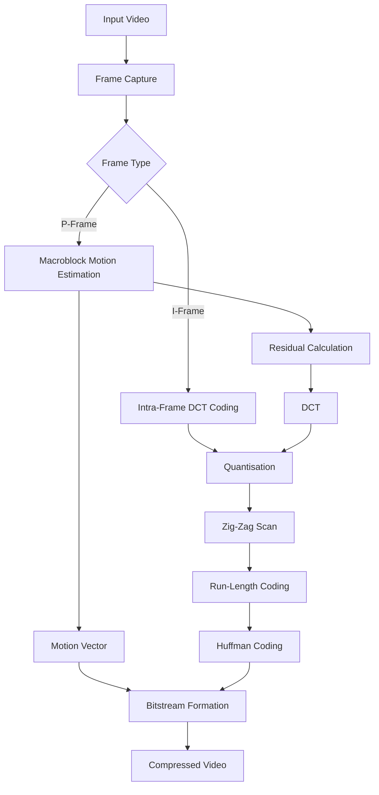

# Efficient Transmission of CCTV Video Streams over Power Line Communication (PLC)

<p align="center">

**Bandwidth-Optimized CCTV Video Transmission Using Power Line Communication**

An undergraduate engineering project by **Group 09**
Department of Electrical and Electronic Engineering
Faculty of Engineering, University of Peradeniya, Sri Lanka

</p>

---

## 📌 Project Overview

Conventional CCTV systems require dedicated communication cables between cameras and monitoring stations. Installing additional communication cables can be difficult and costly, particularly in existing buildings.

This project investigates the use of **Power Line Communication (PLC)** as an alternative communication medium for CCTV video transmission. The existing electrical wiring of a building is used as the communication path while carrying the normal **230 V, 50 Hz** power supply.

The main challenge is that power lines provide a noisy and time-varying communication channel with attenuation, impedance variation, interference and multipath effects. At the same time, CCTV video requires a relatively high data rate.

To address this problem, the project combines:

* A **custom PLC coupling circuit**
* A **motion-based video compression system**
* **DCT-based image and video coding**
* **Motion estimation and motion compensation**
* **Run-Length and Huffman entropy coding**
* **Closed-loop bitrate/quality control**
* **Raspberry Pi-based real-time video processing**
* **UDP packetisation and transmission**
* **Real-time video reconstruction on a PC**

The overall system is designed to reduce the CCTV source bitrate before transmission through a bandwidth-constrained PLC channel.

---

## 🎯 Project Objectives

The main objectives of this project are:

1. Design and fabricate a **PLC coupling circuit** capable of coupling high-frequency communication signals onto a 230 V, 50 Hz power line.

2. Experimentally characterize the transmission of a high-frequency carrier through existing power-line wiring.

3. Develop a **custom image compression algorithm** using transform and entropy coding techniques.

4. Extend the image compression system into a **motion-based video compression system**.

5. Develop a **rate-control mechanism** capable of adapting the encoded bitrate to a specified channel bandwidth or target video quality.

6. Implement the compression and decompression system on a **Raspberry Pi 3 and PC**.

7. Develop a real-time camera-to-display prototype using UDP-based packet transmission.

8. Establish the foundation for complete CCTV video transmission over the physical PLC channel.

---

## 🏗️ System Architecture


### Development-stage architecture

During the current prototype stage, the PLC modems were bypassed for the end-to-end video test:


The PLC coupling circuit was independently tested using a high-frequency signal source and oscilloscope.

---

# ⚡ PLC Coupling Circuit

A **double-LC band-pass coupling network** was designed to interface the communication electronics with the 230 V, 50 Hz power network.

The coupling circuit provides:

* 50 Hz mains rejection
* High-frequency PLC signal coupling
* High-frequency filtering
* Anti-aliasing behaviour
* A defined communication frequency band
* A practical interface between the PLC electronics and power line

The project targeted the broadband PLC frequency region suitable for high-data-rate applications such as video transmission.

### Main Hardware Parameters

| Parameter                     |                 Value |
| ----------------------------- | --------------------: |
| Power-line voltage            |             230 V RMS |
| Mains frequency               |                 50 Hz |
| Practical operating frequency |             ≈ 1.6 MHz |
| Fabricated inductance         |             ≈ 0.46 µH |
| Effective capacitance         |            ≈ 15.67 nF |
| Capacitor arrangement         |   3 × 47 nF in series |
| Theoretical resonance         |           ≈ 1.875 MHz |
| Inductor                      | 18-turn air-core coil |

The experimentally measured response peaked at approximately **1.6 MHz**, while the theoretical resonance was approximately **1.875 MHz**. The difference was attributed to practical effects such as component tolerances, parasitic elements, winding resistance and measurement loading.

### PLC Transmission Test

The high-frequency signal was experimentally transmitted between power-line sockets.

The received signal amplitude decreased with increasing socket separation, demonstrating the attenuation of the communication signal through the power-line channel.

---

# 🎥 Video Compression System

The video codec was developed in multiple stages.

## Stage 1 — Image Compression

The initial image compression system consists of:

```text
Input Image
     ↓
Grayscale Conversion
     ↓
8 × 8 Block Division
     ↓
DCT
     ↓
Quantisation
     ↓
Zig-Zag Scanning
     ↓
Run-Length Coding
     ↓
Huffman Coding
     ↓
Compressed Bitstream
```

The decoder performs the reverse operations:

```text
Compressed Bitstream
        ↓
Huffman Decoding
        ↓
Run-Length Decoding
        ↓
Inverse Zig-Zag
        ↓
Inverse Quantisation
        ↓
IDCT
        ↓
Reconstructed Image
```

---

## Stage 2 — Motion-Based Video Compression

The image codec was extended to video by exploiting **temporal redundancy** between consecutive frames.

The video codec uses:

* I-frames
* P-frames
* Macroblock-based motion estimation
* Motion vectors
* Motion compensation
* Residual calculation
* DCT
* Quantisation
* Zig-zag scanning
* Run-length coding
* Huffman coding

### Video Encoding



For P-frames, the encoder searches the previously reconstructed frame for matching macroblocks and transmits motion information together with the residual difference. This reduces the amount of information that needs to be transmitted when large parts of the surveillance scene remain unchanged.

---

# 🎛️ Rate Control

A closed-loop rate-control layer was developed to adapt the compression parameters according to transmission requirements.

Two operating modes were implemented.

### 1. Bandwidth-Limited Mode

The encoder is provided with a fixed channel bitrate.

```text
Target Channel Bandwidth
          ↓
Frame Bit Budget
          ↓
Quality Factor Search
          ↓
Encode Frame
          ↓
Measure Bitrate
          ↓
Adjust Quantisation
          ↓
Next Frame
```

The objective is to keep the encoded video within the available channel bandwidth.

### 2. Quality-Locked Mode

The encoder is provided with a target PSNR.

The quantisation level is adjusted so that the required image quality is maintained while using as few bits as possible.

The two modes were designed for different PLC conditions: a fixed throughput limitation and a variable channel where the encoder should adapt its bitrate to the required video quality.

---

# 🖥️ Real-Time Raspberry Pi Implementation

The MATLAB codec was subsequently ported to **Python** and deployed on a **Raspberry Pi 3** with a camera module.

### Sender

```text
Camera Module
      ↓
Frame Capture
      ↓
Downscaling
      ↓
Motion Estimation
      ↓
DCT + Quantisation
      ↓
Entropy Coding
      ↓
Packetisation
      ↓
UDP Transmission
```

### Receiver

```text
UDP Reception
      ↓
Packet Reassembly
      ↓
Bitstream Decoding
      ↓
Inverse Quantisation
      ↓
IDCT
      ↓
Motion Compensation
      ↓
Frame Reconstruction
      ↓
Live Display
```

Each compressed frame is divided into smaller UDP chunks. A custom **nine-byte header** is used to identify information such as the frame, chunk sequence, total chunk count, frame type and quantisation level.

---

# 📊 Key Results

### Video Compression

The developed hybrid codec achieved:

| Metric                    |          Result |
| ------------------------- | --------------: |
| Test sequence             |      348 frames |
| Overall compression ratio |   **40.05 : 1** |
| Average PSNR              |    **39.72 dB** |
| Fixed bandwidth target    |    **608 kbps** |
| Achieved bandwidth        | **607.87 kbps** |
| PSNR at 608 kbps          |    **29.82 dB** |
| Quality-locked bitrate    | **516.08 kbps** |
| Quality-locked PSNR       |    **29.35 dB** |

The MATLAB codec therefore demonstrated substantial bitrate reduction while maintaining reconstructed video quality.

### Embedded Prototype

The Raspberry Pi and PC prototype achieved approximately:

* **9.3–9.7 FPS**
* Received PSNR approximately **26.30–31.08 dB**
* Real-time camera capture
* Real-time encoding
* UDP packetisation
* Packet reassembly
* Video reconstruction
* Live display

These results were obtained using the direct Ethernet connection during the prototype validation stage.

---

# 📁 Repository Structure

The repository contains both the MATLAB development stages and the Python real-time implementation.

```text
Efficient-Transmission-Of-CCTV-Video-Streams-Over-Power-Line-Communication-PLC/
│
├── README.md
│
├── MATLAB/
│   ├── image_compression.m
│   ├── Stage_3_1.m
│   ├── Stage_3_2.m
│   └── Stage_3_3.m
│
├── Python/
│   ├── motion_sender3.py
│   └── motion_receiver3.py
│
├── PLC_Coupling_Circuit/
│   ├── Circuit diagrams
│   ├── Design calculations
│   └── Experimental results
│
├── Results/
│   ├── Image compression results
│   ├── Video compression results
│   ├── Rate-control results
│   └── Real-time prototype results
│
└── Documentation/
    └── Project report
```

> **Note:** Update the folder names above if the actual folders in the repository use different names.

---

# 💻 Software and Technologies

### Programming Languages

* MATLAB
* Python

### Embedded Platform

* Raspberry Pi 3
* Raspberry Pi Camera Module

### Image/Video Processing

* Discrete Cosine Transform (DCT)
* Inverse DCT (IDCT)
* Quantisation
* Zig-Zag scanning
* Run-Length Encoding
* Huffman Coding
* Motion Estimation
* Motion Compensation
* Residual Coding
* PSNR analysis

### Networking

* UDP
* Ethernet
* Custom packet fragmentation
* Custom packet headers
* Packet reassembly

### Hardware Testing

* Function Generator
* Oscilloscope
* 230 V power-line network
* Custom air-core inductor
* LC coupling network

---

# 📜 MATLAB Development Stages

## Image Compression

`image_compression.m`

Implements the fundamental image compression pipeline, including DCT, quantisation and entropy coding.

## Stage 1 — Intra-Frame Video Coding

`Stage_3_1.m`

Extends the image compression approach to video frames.

## Stage 2 — Motion-Based Video Coding

`Stage_3_2.m`

Introduces inter-frame coding using macroblock-based motion estimation and fast logarithmic motion search.

## Stage 3 — Hybrid Codec with Rate Control

`Stage_3_3.m`

Implements the improved hybrid video codec with dynamic rate-control feedback.

---

# 🐍 Python Real-Time Implementation

## Sender

`motion_sender3.py`

Responsible for:

* Camera capture
* Frame preprocessing
* Video compression
* Motion-based encoding
* Packet formation
* UDP transmission

## Receiver

`motion_receiver3.py`

Responsible for:

* UDP reception
* Packet reassembly
* Bitstream decoding
* Inverse quantisation
* IDCT
* Motion compensation
* Frame reconstruction
* Live display

---

# 🚀 How to Run

## 1. MATLAB Implementation

Open MATLAB and navigate to the MATLAB source-code directory.

Run the required development stage:

```matlab
image_compression
```

or:

```matlab
Stage_3_1
```

```matlab
Stage_3_2
```

```matlab
Stage_3_3
```

Make sure the required input image/video files are available in the expected directory.

---

## 2. Raspberry Pi Sender

Install the required Python packages according to the project's implementation.

Then run:

```bash
python3 motion_sender3.py
```

The sender captures video from the Raspberry Pi camera, compresses the frames and transmits the resulting packets using UDP.

---

## 3. PC Receiver

Run the receiver application:

```bash
python motion_receiver3.py
```

The receiver listens for UDP packets, reconstructs the compressed frames and displays the reconstructed video.

---

# ⚠️ Important Safety Notice

The PLC coupling circuit is designed for experimentation involving a **230 V AC mains environment**.

**Do not connect the circuit to mains power unless the circuit has been properly verified, insulated and tested by a qualified person.**

Important considerations include:

* Properly rated capacitors
* Insulation
* Creepage and clearance
* Surge protection
* Current limiting
* Protective enclosure
* Appropriate measurement equipment
* Safe isolation procedures

The software in this repository should **not** be interpreted as a safety-certified PLC or mains-interface design.

---

# 🔬 Current Project Status

The project has successfully developed and independently validated two major subsystems:

### ✅ Completed

* PLC coupling circuit design
* Air-core inductor fabrication
* LC network implementation
* 1.6 MHz practical carrier transmission test
* Image compression algorithm
* DCT-based video compression
* Motion estimation
* Motion compensation
* Huffman coding
* Rate-control algorithms
* MATLAB simulation and evaluation
* Python implementation
* Raspberry Pi camera integration
* UDP packetisation
* PC-side video reconstruction
* Real-time Ethernet-based prototype

### 🔄 Next Development Stage

The next stage is to integrate the two validated subsystems into a complete PLC video transmission system.

Planned work includes:

* Integration of the PLC modem with the coupling circuits
* Replacing the Ethernet link with the power-line communication path
* Modulation and demodulation of the compressed video stream
* End-to-end CCTV transmission over the power line
* Testing under different power-line conditions
* Measuring actual PLC throughput
* Optimising the embedded encoder
* Improving error resilience
* Testing across multiple sockets and load conditions

These activities are identified as the future development direction in the project report.

---

# 📈 Future Improvements

Future development of the project will focus on:

1. **Full PLC Integration**
   Connect the video codec directly to a PLC modem and transmit the compressed video through the fabricated coupling circuits.

2. **Embedded Codec Optimisation**
   Reduce computational complexity and improve compression efficiency on the Raspberry Pi.

3. **Error Resilience**
   Investigate Forward Error Correction (FEC), multiple-description coding and adaptive GOP structures to reduce the effect of packet loss.

4. **Adaptive PLC Rate Control**
   Adapt the video bitrate according to the actual available PLC channel capacity.

5. **Real-World Building Tests**
   Evaluate performance across multiple rooms, sockets, branch circuits and electrical load conditions.

6. **Improved Hardware Implementation**
   Develop a more robust PLC modem and coupling interface suitable for practical deployment.

---

# 📚 Project Report

The complete project report contains the detailed:

* Literature review
* PLC coupling circuit design
* Component calculations
* Inductor fabrication procedure
* Image compression methodology
* Video compression methodology
* Rate-control algorithms
* Raspberry Pi implementation
* Experimental measurements
* Results and discussion
* Future development

---

# 👥 Project Team

### Group 09

**B.S. Nadew**
E/21/261

**B.M. Piyumantha**
E/21/308

**S.H.Y.S. Seelawansha**
E/21/366

### Supervisors

**Prof. Janaka Ekanayake**
**Prof. Maheshi Dissanayake**
**Dr. Sudheera Nawaratne**

Department of Electrical and Electronic Engineering
Faculty of Engineering
University of Peradeniya
Sri Lanka

---

# 📖 References

The project was developed based on research covering:

* Power Line Communication
* PLC channel characteristics
* Broadband PLC
* PLC coupling and modem design
* CCTV transmission over PLC
* Video streaming over power-line networks
* Multimedia compression for PLC

The project report contains the complete reference list.

---

## ⭐ Project Summary

> **This project demonstrates a bandwidth-conscious approach to CCTV transmission over existing electrical wiring by combining a custom PLC coupling interface with motion-based video compression and real-time embedded processing.**

The developed system addresses both major challenges of CCTV-over-PLC:

**Physical Layer:**
Safely couple a high-frequency communication signal to the existing power-line network.

**Application Layer:**
Reduce the CCTV video bitrate using spatial and temporal compression so that the video can operate within a constrained communication channel.

The current prototype validates these subsystems independently and establishes the foundation for complete end-to-end CCTV transmission over the power-line channel.

---

<p align="center">

**Efficient Transmission of CCTV Video Streams over Power Line Communication (PLC)**

**Group 09 | Department of Electrical and Electronic Engineering | University of Peradeniya**

</p>
